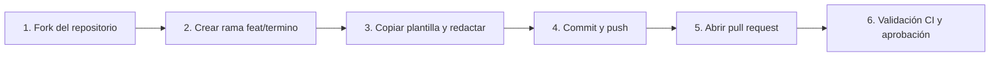

# 🚀 Guía de contribución al glosario

¡Bienvenido a la guía de contribución del **Glosario colaborativo de ciberseguridad del IES Celia Viñas**!

Este proyecto utiliza la metodología **Docs-as-Code** (*Documentación como código*). Todo el glosario se gestiona mediante control de versiones en Git y se publica automáticamente en GitHub Pages tras validar cada aportación mediante **Pull Requests (PR)**.

---

## 📋 Requisitos previos

Antes de comenzar, asegúrate de contar con:

- Una cuenta en [GitHub](https://github.com).
- [Git](https://git-scm.com) instalado y configurado en tu equipo.

---

## 🛠️ Flujo de trabajo paso a paso



### Paso 1: Hacer un fork del repositorio
1. Dirígete al repositorio principal en GitHub: `https://github.com/cibercelia/glosario`.
2. Haz clic en el botón **Fork** (arriba a la derecha) para crear una copia en tu cuenta personal.

---

### Paso 2: Clonar y crear una rama de trabajo
Abre tu terminal y clona tu repositorio bifurcado (sustituye `TU-USUARIO` por tu usuario de GitHub):

```bash
git clone https://github.com/TU-USUARIO/glosario.git
cd glosario
git checkout -b feat/nombre-del-termino
```

!!! tip "Consejo para el nombre de la rama"
    Nombra la rama con el prefijo `feat/` seguido del nombre del concepto en minúsculas y separado por guiones (formato *kebab-case*), por ejemplo: `feat/cross-site-scripting` o `feat/ransomware`.

---

### Paso 3: Crear tu término usando la plantilla
1. Copia la plantilla oficial `plantilla.md` a la carpeta `terminos/` con el nombre de tu término en minúsculas:
   ```bash
   cp plantilla.md terminos/nombre-del-termino.md
   ```
2. Abre `terminos/nombre-del-termino.md` en tu editor de código (VS Code, etc.).
3. Rellena los **metadatos YAML (Frontmatter)** obligatorios al inicio del archivo:
   ```yaml
   ---
   title: "Nombre del término"
   category: "Vulnerabilidades Web" # Categoría del concepto
   author: "@tu-usuario-github" # Tu usuario para darte crédito
   tags:
     - ciberseguridad
     - web
     - owasp
   summary: "Resumen explicativo del término en 1 o 2 frases concisas."
   ---
   ```
4. Desarrolla las secciones requeridas siguiendo la [Plantilla de términos](plantillas/plantilla-termino.md):
   - **📖 Definición**: Qué es y contexto técnico.
   - **⚙️ ¿Cómo funciona?**: Flujo, arquitectura o principios.
   - **🎯 Ejemplo práctico**: Escenario vulnerable vs seguro con código si aplica.
   - **🛡️ Mitigación y buenas prácticas**: Recomendaciones oficiales (OWASP, NIST, CIS...).
   - **🔗 Referencias**: Enlaces a fuentes fiables.

---

### Paso 4: (Opcional) Probar la web en local con Docker

Si deseas comprobar cómo se visualiza la web con Docker:

```bash
docker compose -f .mkdocs/compose.yaml up
```

Abre tu navegador en: **[http://localhost:8000](http://localhost:8000)**

---

### Paso 5: Confirmar cambios y subir la rama
Una vez revisado el resultado:

```bash
git add terminos/nombre-del-termino.md
git commit -m "feat(terminos): añadir definición de <nombre-del-termino>"
git push origin feat/nombre-del-termino
```

---

### Paso 6: Abrir el pull request (PR)
1. Ve a la página de tu fork en GitHub y pulsa en **"Compare & pull request"**.
2. Completa la plantilla de PR marcando las casillas del checklist.
3. El sistema de Integración Continua (GitHub Actions) ejecutará automáticamente las pruebas de validación:
   - Formato de nombre de archivo (*kebab-case*).
   - Metadatos YAML completos (`title`, `category`, `author`, `tags`, `summary`).
   - Compilación estricta de MkDocs sin enlaces rotos.
4. Cuando el profesorado o moderadores revisen y aprueben tu PR, se fusionará en la rama principal y aparecerá publicado en la web.

---

## ⚠️ Reglas de calidad y buenas prácticas

- **Originalidad**: Redacta las explicaciones con tus propias palabras y cita siempre las fuentes consultadas.
- **Rigor técnico**: Utiliza terminología precisa y estándares de la industria (OWASP, NIST, MITRE ATT&CK, RFCs).
- **Ejemplos claros**: Los bloques de código deben estar formateados y comentados.
