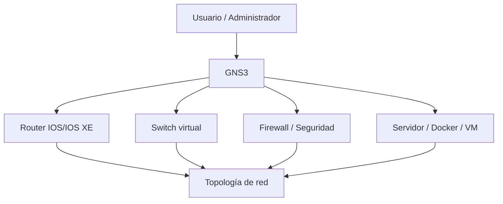

# GNS3 (Graphical Network Simulator-3)

  

    Categoría
    Virtualización y Simulación de Redes / Laboratorios
  

  

    Tipo
    Emulador de redes
  

  

    Autor
    <a href="https://github.com/MiuAkari" target="_blank">@MiuAkari</a>
  

## 📖 Definición

**GNS3** (*Graphical Network Simulator-3*) es una herramienta de emulación y simulación de redes que permite crear topologías virtuales de infraestructura para probar configuraciones, validar diseños, entrenar habilidades operativas y reproducir escenarios complejos sin depender exclusivamente de hardware físico.

Su valor principal radica en que combina distintos elementos: dispositivos virtualizados (por ejemplo, routers y switches), nodos de laboratorio, contenedores y, en muchos casos, imágenes oficiales de fabricantes como Cisco, Juniper o Arista. Esto permite construir entornos realistas de red para tareas de diseño, resolución de problemas, automatización y formación.

!!! tip "Uso frecuente"
    GNS3 es especialmente útil en entornos de ciberseguridad, redes, automatización y formación técnica porque permite reproducir una infraestructura con un coste mucho menor que un laboratorio físico completo.

---

## 🧩 ¿Cómo funciona?

GNS3 se basa en una representación visual de la topología donde cada nodo se conecta a otros mediante enlaces y se configura como si estuviese en un entorno real. La herramienta gestiona la vida del laboratorio y, según la imagen o motor asociado, puede emular sistema operativo del router, switch o firewall, o bien conectar dispositivos virtualizados y servicios de red.

En la práctica, esto permite:

- Diseñar redes desde cero con múltiples segmentos.
- Simular rutas, ACLs, VLANs, OSPF, BGP o políticas de seguridad.
- Probar cambios de configuración antes de desplegarlos en producción.
- Reproducir incidentes de red o escenarios de respuesta a incidentes.

---

## 🛠️ Casos de uso más comunes

- **Formación y certificaciones**: laboratorios para CCNA, CCNP, seguridad y redes en general.
- **Validación de configuración**: comprobar cambios de direccionamiento, protocolos y políticas de enrutamiento.
- **Pruebas de seguridad**: recrear entornos con firewalls, IDS/IPS y segmentación de red.
- **Diagnóstico de incidentes**: reproducir fallos de conectividad o comportamiento de tráfico.
- **Automatización**: crear topologías reproducibles para pruebas con scripts, Ansible, Python o herramientas de orquestación.

---

## ⚠️ Ventajas y limitaciones

### Ventajas

- Reduce significativamente el coste frente a un laboratorio físico.
- Permite reutilizar y versionar topologías de red.
- Facilita la experimentación con infraestructuras complejas.
- Ofrece flexibilidad para integrar simulación, virtualización y servicios Linux.

### Limitaciones

- El rendimiento depende de los recursos del equipo anfitrión.
- Algunas imágenes o funciones de dispositivos no son totalmente equivalentes a hardware real.
- Requiere conocimientos de redes y virtualización para montar entornos complejos.
- La emulación de ciertos dispositivos puede requerir licencias o imágenes específicas.

---

## 🔐 Relación con la seguridad y la práctica profesional

GNS3 es una herramienta muy útil para practicar escenarios de seguridad de red sin afectar sistemas de producción. Por ejemplo, se puede recrear una infraestructura con:

- Segmentación por VLANs y ACLs.
- Reglas de cortafuegos y políticas de filtrado.
- VPNs, túneles y servicios de acceso remoto.
- Detección de tráfico sospechoso y análisis de rutas.

Esto permite entrenar procedimientos de respuesta ante amenazas, validar controles de seguridad y comprender cómo los cambios de red impactan en la resiliencia y la visibilidad del entorno.

---

## 🔗 Referencias

- [Sitio oficial de GNS3](https://www.gns3.com/)
- [Documentación oficial de GNS3](https://docs.gns3.com/)
- [GNS3 Academy](https://www.gns3.com/academy)
- [Cisco Networking Academy](https://www.netacad.com/)
