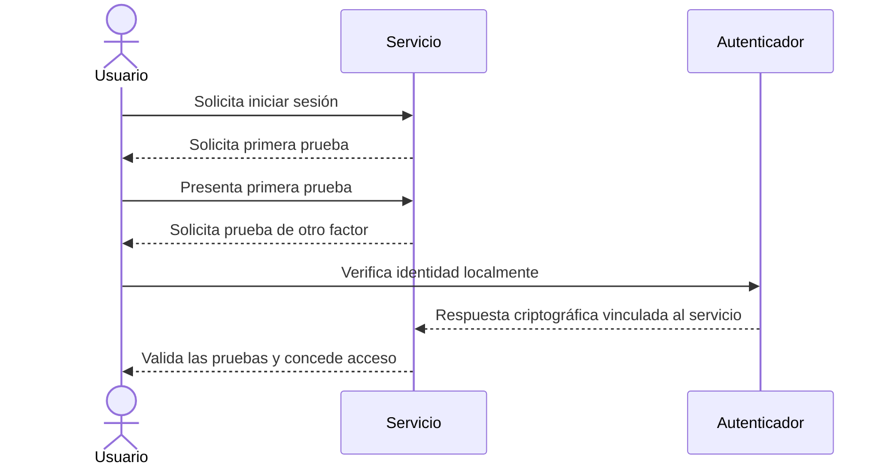

# Autenticación multifactor (MFA)

  

    Categoría
    Identidad y Gestión de Accesos
  

  

    Estándar
    NIST SP 800-63B-4 | FIDO2 / WebAuthn
  

  

    Autor
    <a href="https://github.com/mariocq-ciber" target="_blank">@mariocq-ciber</a>
  

## 📖 Definición

La **autenticación multifactor (MFA, *Multi-Factor Authentication*)** es un mecanismo de verificación de identidad que exige al usuario demostrar que controla **dos o más factores de categorías distintas** antes de conceder acceso a una cuenta, aplicación o servicio. Si una contraseña queda expuesta, un segundo factor independiente puede impedir que quien la haya obtenido inicie sesión.

Las categorías clásicas de factores son:

| Categoría | Qué demuestra | Ejemplos |
| :--- | :--- | :--- |
| **Algo que sabes** | Conocimiento de un secreto | Contraseña, frase de paso o PIN |
| **Algo que tienes** | Control de un dispositivo o elemento | Llave de seguridad, teléfono o token criptográfico |
| **Algo que eres** | Una característica biométrica | Huella dactilar o reconocimiento facial |

!!! warning "No todos los segundos pasos son MFA"
    Para ser multifactor, las pruebas deben pertenecer a **categorías diferentes**. Una contraseña y un PIN son dos secretos que sabes, no dos factores independientes. Además, MFA no garantiza por sí sola que una cuenta sea invulnerable: la resistencia al phishing depende del método utilizado, y los procesos de recuperación también deben estar protegidos.

---

## ⚙️ ¿Cómo funciona? / Principios fundamentales

1. **Inicio de sesión**: el usuario identifica la cuenta y presenta el primer factor, habitualmente una contraseña o una llave de acceso (*passkey*).
2. **Verificación adicional**: el servicio solicita una prueba de otra categoría, como la aprobación criptográfica en una llave de seguridad o un código temporal generado por una aplicación.
3. **Validación y acceso**: el sistema valida ambas pruebas y concede la sesión si son correctas; si una falla, debe denegar o limitar el acceso según su política.
4. **Gestión del ciclo de vida**: el alta, la sustitución y la recuperación de factores requieren controles propios, porque un atacante que pueda restablecer el segundo factor puede eludir la protección.

La seguridad varía según el método de segundo factor:

| Método | Ventaja | Limitación importante |
| :--- | :--- | :--- |
| **SMS o llamada** | Fácil de adoptar y no requiere una aplicación especial | Puede verse afectado por intercambio fraudulento de SIM, interceptación o redirección de mensajes; no es resistente al phishing |
| **Código TOTP** | Funciona sin conexión móvil y es más difícil de interceptar a distancia que un SMS | El usuario puede introducir el código en una página falsa; el código sigue siendo susceptible al phishing en tiempo real |
| **Notificación push** | Experiencia sencilla y respuesta rápida | Las solicitudes repetidas pueden provocar aprobación por fatiga; una aprobación push convencional no siempre resiste el phishing |
| **Passkey o llave FIDO2/WebAuthn** | La prueba criptográfica está vinculada al servicio legítimo y es resistente al phishing | Requiere dispositivos y procesos de recuperación bien gestionados |

Una passkey o llave FIDO2/WebAuthn puede realizar la autenticación con verificación local del usuario, por ejemplo mediante PIN o biometría. Esa verificación se realiza en el dispositivo y no implica enviar la huella o el rostro al servicio. La configuración concreta determina si se cumplen los requisitos de MFA de cada organización o servicio.

---

## 🎯 Ejemplo práctico o escenario de demostración

Una persona introduce su contraseña en el portal de correo desde un equipo nuevo. La contraseña por sí sola no basta: el portal exige una segunda prueba antes de crear la sesión.

=== "Escenario con protección insuficiente"

    El servicio acepta únicamente la contraseña o envía un código por SMS como única alternativa. Un atacante que robe la contraseña mediante una página falsa puede intentar engañar a la víctima para que comparta el código, o abusar de un cambio fraudulento de SIM. La presencia de un segundo paso no convierte automáticamente el inicio de sesión en resistente al phishing.

=== "Escenario bien configurado"

    El servicio requiere una passkey o llave de seguridad FIDO2/WebAuthn. El usuario verifica su identidad en el dispositivo y este responde al desafío criptográfico del dominio legítimo. Una página impostora no puede reutilizar esa respuesta en el sitio real. El servicio protege también el alta y la recuperación de llaves con controles equivalentes.

---

## 🛡️ Medidas de mitigación y buenas prácticas

- [x] **Priorizar factores resistentes al phishing**: ofrecer passkeys o llaves FIDO2/WebAuthn, especialmente para cuentas privilegiadas, administración y acceso remoto.
- [x] **Elegir alternativas con conocimiento de sus límites**: cuando no se disponga de FIDO2, preferir una aplicación TOTP frente a SMS siempre que sea viable; no presentar TOTP ni las notificaciones push convencionales como resistentes al phishing.
- [x] **Proteger las notificaciones push**: limitar solicitudes, mostrar contexto verificable y utilizar coincidencia numérica cuando esté disponible. Rechazar y reportar cualquier solicitud que el usuario no haya iniciado.
- [x] **Asegurar el enrolamiento y la recuperación**: verificar la identidad antes de añadir, sustituir o eliminar factores; proteger la recuperación con controles sólidos y notificar los cambios por un canal independiente.
- [x] **Preparar la pérdida de dispositivos**: ofrecer códigos de recuperación de un solo uso, almacenables de forma segura, y revocar de inmediato los autenticadores perdidos o comprometidos.
- [x] **Reducir el impacto de errores y ataques**: aplicar límites a intentos, alertas de inicio de sesión y supervisión de cambios de factores; evitar que la mesa de ayuda restablezca MFA con verificaciones débiles.
- [x] **No confiar solo en MFA**: combinarlo con contraseñas únicas o passkeys, mínimo privilegio, protección de sesiones, actualizaciones y detección de actividad anómala.

---

## 🔗 Referencias y enlaces de interés

- [NIST SP 800-63B-4: Authentication and Authenticator Management](https://pages.nist.gov/800-63-4/sp800-63b.html)
- [OWASP Multifactor Authentication Cheat Sheet](https://cheatsheetseries.owasp.org/cheatsheets/Multifactor_Authentication_Cheat_Sheet.html)
- [CISA: Implementing Phishing-Resistant MFA](https://www.cisa.gov/resources-tools/resources/implementing-phishing-resistant-mfa)
- [FIDO Alliance: Passkeys](https://fidoalliance.org/passkeys/)