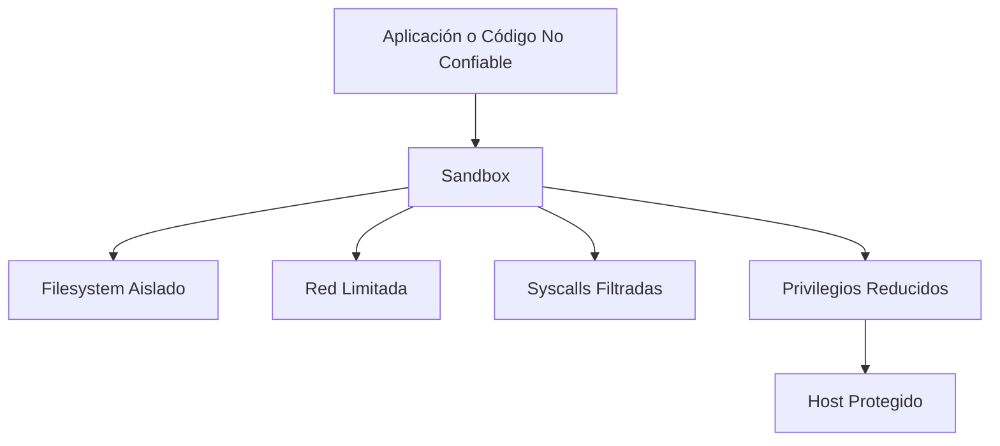

# Sandboxing

<div class="term-meta-box">
  <div class="term-meta-item">
    <span class="term-meta-label">Categoría</span>
    <span class="term-meta-value">Contención y Aislamiento de Ejecución</span>
  </div>
  <div class="term-meta-item">
    <span class="term-meta-label">Enfoque</span>
    <span class="term-meta-value">Seguridad de Sistemas / Contención</span>
  </div>
  <div class="term-meta-item">
    <span class="term-meta-label">Autor</span>
    <span class="term-meta-value"><a href="https://github.com/cibercelia" target="_blank">@cibercelia</a></span>
  </div>
</div>

## 📖 Definición

**Sandboxing** es una técnica de seguridad que consiste en ejecutar un programa, un proceso, un navegador, un script o incluso una aplicación completa dentro de un entorno restringido y aislado del resto del sistema. El objetivo es limitar su capacidad de interactuar con recursos críticos del host, reducir el impacto de un fallo o de un código malicioso y controlar de forma explícita qué archivos, redes o llamadas al sistema puede utilizar.

En esencia, el sandbox actúa como una “caja de seguridad”: todo lo que ocurre dentro de él está sometido a políticas estrictas de ejecución, privilegios, red, almacenamiento y observabilidad. Si un componente se ve comprometido, el daño potencial queda acotado al propio sandbox y no se extiende libremente al sistema operativo o a otros servicios.

!!! note "Importante"
    Sandboxing no elimina la vulnerabilidad en sí, pero sí reduce drásticamente su radio de impacto y ayuda a contener amenazas, análisis de malware, ejecución de código no confiable y errores de configuración.

---

## 🧩 ¿Cómo funciona?

La efectiva del sandboxing se basa en combinar varias capas de contención y control:

1. **Aislamiento del proceso**: Se utiliza separación de espacios de ejecución, como namespaces y control de montaje, para que el proceso vea solo un subconjunto del sistema de archivos, de la red y de otros recursos.
2. **Reducción de privilegios**: La aplicación se ejecuta como un usuario no privilegiado, con capacidades mínimas y sin permisos administrativos sobre el sistema host.
3. **Filtrado de llamadas al sistema**: Técnicas como **seccomp-bpf**, **AppArmor** o **SELinux** bloquean o permiten únicamente las syscalls necesarias para el software.
4. **Límites de recursos**: Se imponen restricciones de CPU, memoria, E/S, número de procesos y uso de red para evitar abuso o denegación de servicio.
5. **Monitoreo y auditoría**: Se registran eventos, accesos y comportamientos para detectar desviaciones o intentos de escape del sandbox.



---

## 🛡️ Tipos de Sandboxing

| Tipo | Descripción | Ejemplo Común |
| :--- | :--- | :--- |
| **Sandbox de navegador** | Aísla páginas web, scripts y plugins del sistema operativo. | Chrome / Chromium / Firefox |
| **Sandbox de aplicación** | Ejecuta un programa en un entorno con permisos y acceso mínimos. | Ejecutables de usuarios, plugins, visualizadores |
| **Sandbox de contenedores** | Aísla procesos mediante namespaces, cgroups y políticas de seguridad. | Docker, Kubernetes, OCI |
| **Máquina virtual** | Aísla completamente el sistema operativo en un hipervisor. | QEMU, Hyper-V, VMware |
| **Sandbox de malware / análisis** | Permite ejecutar código sospechoso sin poner en riesgo el entorno real. | Entornos de malware analysis |

---

## 🎯 Ejemplo Práctico: Contenedor Ejecutándose con Aislamiento

Un entorno de contenedores puede reforzar el sandboxing con políticas de seguridad para evitar que una aplicación comprometida acceda al anfitrión o a otros servicios.

=== "❌ Configuración Poco Segura"

    ```bash
    docker run --privileged --network host --pid host \
      --cap-add SYS_ADMIN \
      -v /:/host \
      vulnerable-app:latest
    ```

    En este caso, el contenedor tiene casi todo el poder del host. Un fallo de seguridad o ejecución de código malicioso podría escalar el impacto de forma significativa.

=== "✅ Configuración Segura"

    ```bash
    docker run --rm --read-only \
      --network none \
      --cap-drop ALL \
      --security-opt no-new-privileges:true \
      --pids-limit 128 \
      --memory 256m \
      app-sandboxed:latest
    ```

    Aquí el contenedor queda aislado por defecto: sin privilegios, sin acceso de red, con límites de memoria y procesos, y sin posibilidad de elevar permisos durante la ejecución.

---

## 🛡️ Medidas de Mitigación y Buenas Prácticas

1. **Reducir privilegios de forma explícita**: Evitar ejecutarse como `root` y eliminar capacidades innecesarias.
2. **Aplicar perfiles de seguridad**: Usar `seccomp`, `AppArmor` o `SELinux` para limitar syscalls y accesos del proceso.
3. **Aislar redes**: Desactivar acceso externo o restringir el tráfico por políticas de red mínimas.
4. **Usar sistemas de archivos de solo lectura**: Cuando sea posible, evitar escritura en el sistema de archivos del contenedor o aplicación.
5. **Reforzar límites de recursos**: Definir límites de memoria, CPU, procesos y E/S para reducir el riesgo de abuso o denegación de servicio.
6. **Monitorear comportamiento**: Tener logs, métricas, alertas y análisis de anomalías para detectar abuso del sandbox.
7. **Mantener imágenes y dependencias actualizadas**: Los parches de kernel, librerías y runtimes reducen la superficie de explotación.

---

## 🔗 Referencias

- [Docker Security Best Practices](https://docs.docker.com/develop/security-best-practices/)
- [Linux man page: namespaces](https://man7.org/linux/man-pages/man7/namespaces.7.html)
- [Linux man page: seccomp](https://man7.org/linux/man-pages/man2/seccomp.2.html)
- [Google Chrome Sandbox Architecture](https://chromium.googlesource.com/chromium/src/+/main/docs/security/sandbox_design.md)
- [NIST SP 800-190: Application Container Security Guide](https://csrc.nist.gov/publications/detail/sp/800-190/final)
