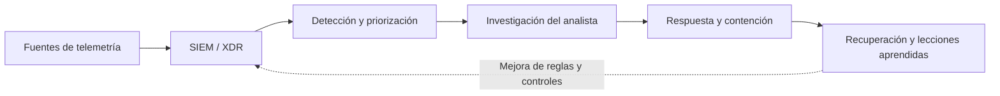

# SOC (Centro de operaciones de seguridad)

  

    Categoría
    Operaciones y Monitorización de Seguridad
  

  

    Denominación
    Security Operations Center (SOC) / Centro de operaciones de seguridad
  

  

    Autor
    <a href="https://github.com/cibercelia" target="_blank">@cibercelia</a>
  

## 📖 Definición

Un **SOC (Security Operations Center)** o **Centro de Operaciones de Seguridad** es la función, equipo o unidad responsable de proteger de forma continua los activos digitales de una organización. Para ello, centraliza la monitorización de eventos, identifica posibles amenazas, investiga las alertas y coordina la respuesta y recuperación ante incidentes de ciberseguridad.

Un SOC combina personas, procesos y tecnología. Puede operar con personal interno, mediante un proveedor externo (**MSSP**, *Managed Security Service Provider*) o con un modelo híbrido. Sus herramientas suelen incluir soluciones **SIEM** para recopilar y correlacionar eventos, **EDR/XDR** para observar endpoints y cargas de trabajo, inteligencia de amenazas y plataformas **SOAR** para automatizar tareas repetitivas.

!!! note "SOC no es sinónimo de SIEM"
    El **SIEM** es una tecnología que recoge, normaliza y correlaciona registros. El **SOC** es la capacidad operativa más amplia que utiliza esa y otras tecnologías junto con analistas, procedimientos y coordinación de incidentes para tomar decisiones y actuar.

---

## ⚙️ ¿Cómo funciona? / Principios fundamentales

El funcionamiento de un SOC se basa en un ciclo continuo de visibilidad, análisis y respuesta:

1. **Recopilación y normalización**: Reúne registros y señales de firewalls, servidores, identidades, endpoints, aplicaciones, servicios en la nube y dispositivos de red. La normalización permite analizarlos con un formato común y conservar el contexto necesario.
2. **Detección y priorización**: Aplica reglas, modelos analíticos e inteligencia de amenazas para identificar comportamientos anómalos. Las alertas se clasifican según su criticidad, probabilidad, impacto y relevancia para el negocio.
3. **Análisis e investigación**: Los analistas validan si una alerta es un falso positivo o parte de un incidente real. Para ello, construyen una línea temporal, relacionan evidencias y determinan el alcance, el vector de ataque y los activos afectados.
4. **Respuesta y coordinación**: El SOC ejecuta o recomienda acciones como aislar un endpoint, bloquear un indicador, revocar una sesión, deshabilitar una cuenta comprometida o escalar el caso a los responsables de sistemas, legal o dirección.
5. **Recuperación y mejora continua**: Documenta el incidente, elimina la causa, verifica la recuperación y ajusta detecciones, procedimientos y controles para reducir la probabilidad de repetición.

Los niveles de operación suelen organizarse en **L1** (triaje y clasificación), **L2** (investigación y respuesta) y **L3** (análisis avanzado, ingeniería de detecciones y búsqueda proactiva de amenazas). También puede incluir funciones de *threat hunting*, gestión de vulnerabilidades, inteligencia de amenazas y coordinación de incidentes.

---

## 🎯 Ejemplo práctico: detección de una cuenta comprometida

Una cuenta corporativa inicia sesión desde una ubicación inusual y, pocos minutos después, descarga un volumen elevado de información y crea una regla de reenvío de correo.

=== "❌ Operación deficiente"

    - Cada sistema conserva sus alertas sin enviarlas a un punto común de análisis.
    - No existe una línea de guardia ni un procedimiento para clasificar la alerta.
    - El equipo deshabilita la cuenta sin preservar evidencias ni comprobar otras sesiones activas.
    - No se revisan las reglas de detección ni se documenta el incidente, por lo que el mismo patrón puede repetirse.

=== "✅ Operación de un SOC maduro"

    1. El proveedor de identidad, el correo y el proxy envían telemetría al SIEM.
    2. Una regla correlaciona el inicio de sesión anómalo, la descarga masiva y la creación de la regla de reenvío, y asigna una prioridad alta.
    3. Un analista valida el contexto, revisa la línea temporal y confirma el compromiso mediante los registros de autenticación y endpoint.
    4. El SOC revoca las sesiones y tokens, fuerza el cambio de credenciales, bloquea los indicadores y coordina la revisión de accesos y datos afectados.
    5. Tras la recuperación, documenta el caso, notifica a las partes correspondientes y mejora la detección y las políticas de autenticación multifactor.

---

## 🛡️ Medidas de mitigación y buenas prácticas

- [x] **Definir un modelo operativo**: Establecer responsabilidades, turnos, niveles de escalado, acuerdos de nivel de servicio (SLA) y criterios para declarar y comunicar incidentes.
- [x] **Centralizar telemetría útil**: Integrar fuentes relevantes, sincronizar el tiempo, proteger los registros frente a modificaciones y definir periodos de retención acordes con las necesidades legales y operativas.
- [x] **Reducir el ruido de alertas**: Ajustar reglas con datos reales, eliminar duplicados, asignar prioridades por riesgo y medir falsos positivos, tiempo medio de detección (MTTD) y tiempo medio de respuesta (MTTR).
- [x] **Preparar procedimientos de respuesta**: Mantener *playbooks* probados para phishing, ransomware, robo de credenciales, malware y exfiltración de datos, incluyendo responsables y acciones de contención.
- [x] **Aplicar defensa en profundidad**: Combinar SIEM, EDR/XDR, MFA, gestión de vulnerabilidades, segmentación de red, copias de seguridad y controles de identidad, sin depender de una única herramienta.
- [x] **Proteger el propio SOC**: Aplicar mínimo privilegio, MFA, separación de funciones, control de acceso a la plataforma de monitorización y auditoría de las acciones de los analistas.
- [x] **Practicar y mejorar**: Realizar ejercicios de simulación, revisiones posteriores a incidentes, búsqueda proactiva de amenazas y actualización de casos de uso e inteligencia.

---

## 🔗 Referencias y enlaces de interés

- [NIST SP 800-61 Rev. 2: Computer Security Incident Handling Guide](https://csrc.nist.gov/publications/detail/sp/800-61/rev-2/final)
- [NIST Cybersecurity Framework 2.0](https://www.nist.gov/cyberframework)
- [MITRE ATT&CK: Enterprise](https://attack.mitre.org/matrices/enterprise/)
- [CISA: Incident Response Plan (IRP) Basics](https://www.cisa.gov/resources-tools/resources/incident-response-plan-irp-basics)
- [CIS Controls v8: Continuous Vulnerability Management and Audit Log Management](https://www.cisecurity.org/controls/v8)