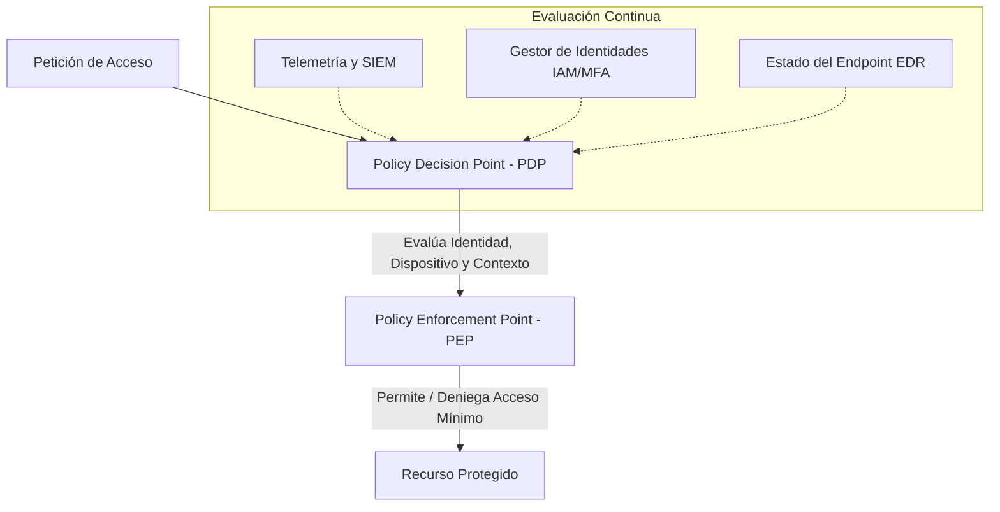

# Zero Trust (confianza cero)

  

    Categoría
    Arquitectura y Seguridad en Redes
  

  

    Estándar
    NIST SP 800-207
  

  

    Autor
    <a href="https://github.com/cibercelia" target="_blank">@cibercelia</a>
  

## 📖 Definición

**Zero Trust** (confianza cero) es una filosofía y modelo estratégico de seguridad integral que asume que las amenazas existen tanto fuera como dentro del perímetro tradicional de la red. Bajo el paradigma de **"Nunca confiar, siempre verificar"** (*Never Trust, Always Verify*), ningún usuario, dispositivo, servicio o flujo de red se considera confiable por defecto, independientemente de su ubicación física o de red corporativa.

!!! warning "Importante"
    Zero Trust no es un producto o herramienta concreta que se compra, sino una arquitectura y marco de trabajo continuo que combina identidades robustas, microsegmentación, observabilidad y políticas dinámicas basadas en contexto.

---

## 🏛️ Los tres principios fundamentales (NIST SP 800-207)

1. **Verificar Explícitamente**: Autenticar y autorizar siempre en función de todos los puntos de datos disponibles (identidad del usuario, ubicación, estado de salud del dispositivo, servicio solicitado y anomalías de comportamiento).
2. **Uso del Acceso de Mínimo Privilegio (PoLP)**: Limitar el acceso de los usuarios mediante acceso Just-In-Time (JIT) y Just-Enough-Access (JEA), políticas adaptativas basadas en riesgo y protección de datos en reposo y en tránsito.
3. **Asumir la Brecha (*Assume Breach*)**: Minimizar el radio de impacto (*blast radius*) dividiendo el acceso por segmentos de red, cifrando las comunicaciones de extremo a extremo y utilizando análisis automatizados para detectar amenazas en tiempo real.

---

## 🔍 Comparativa: modelo tradicional vs. Zero Trust

| Característica | Modelo Perimetral Clásico ("Castillo y Foso") | Modelo Zero Trust |
| :--- | :--- | :--- |
| **Confianza** | Implícita para todo lo que esté dentro de la LAN/VPN. | Nula por defecto; verificación explícita por transacción. |
| **Acceso a la Red** | Acceso a todo el segmento de red tras conectar por VPN. | Acceso exclusivo a la aplicación específica (**ZTNA**). |
| **Segmentación** | Grandes zonas de red (VLANs estáticas). | **Microsegmentación** granular a nivel de carga de trabajo. |
| **Evaluación** | Solo en el momento del login. | **Continua** durante toda la sesión. |

---

## 🛡️ Pilares de implementación

- **Identidades**: Autenticación multifactor robusta (MFA/FIDO2) y gestión de ciclo de vida de accesos (IAM/PAM).
- **Dispositivos**: Verificación del cumplimiento del estado del endpoint (antivirus activo, parcheado de SO, cifrado de disco BitLocker/FileVault).
- **Redes**: Microsegmentación y ZTNA (Zero Trust Network Access) reemplazando a las VPNs corporativas heredadas.
- **Aplicaciones y Datos**: Cifrado, clasificación automática de información y políticas de DLP (Data Loss Prevention).
- **Visibilidad y Automatización**: Integración con soluciones XDR / SIEM / SOAR para respuesta dinámica a incidentes.

---

## 🔗 Referencias

- [NIST Special Publication 800-207: Zero Trust Architecture](https://csrc.nist.gov/publications/detail/sp/800-207/final)
- [CISA Zero Trust Maturity Model v2.0](https://www.cisa.gov/zero-trust-maturity-model)
- [Microsoft Zero Trust Guidance Center](https://learn.microsoft.com/en-us/security/zero-trust/)
